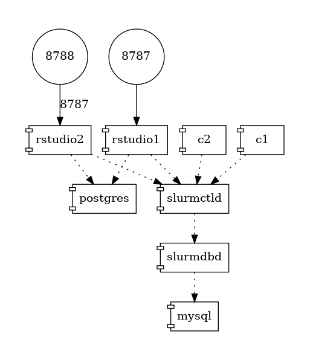
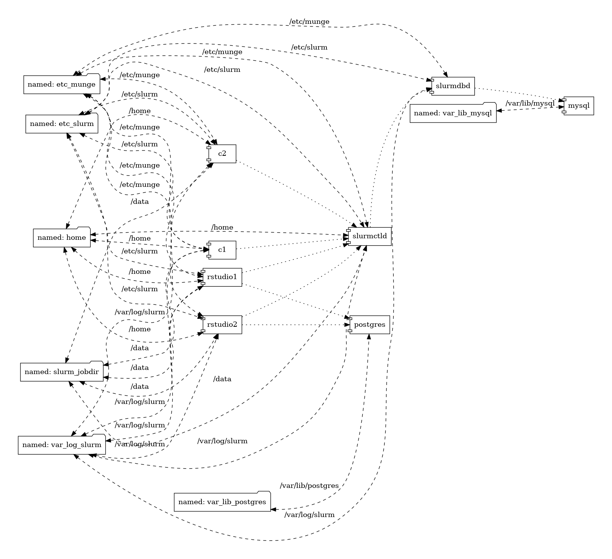

# Slurm Docker Cluster

This is a multi-container Slurm cluster using docker-compose.  The compose file
creates named volumes for persistent storage of MySQL and Postgres data files as well as
Slurm state and log directories.

## Containers and Volumes

The compose file will run the following containers:

* mysql
* postgres
* slurmdbd
* slurmctld
* c1 (slurmd)
* c2 (slurmd)
* rstudio1
* rstudio2

The compose file will create the following named volumes:

* etc_munge         	 ( -> /etc/munge     )
* etc_slurm         	 ( -> /etc/slurm     )
* slurm_jobdir      	 ( -> /data          )
* var_lib_mysql     	 ( -> /var/lib/mysql )
* var_libpostgres     	 ( -> /var/lib/postgres )
* var_log_slurm     	 ( -> /var/log/slurm )
* home	 		 ( -> /home )
* var_lib_rstudio_server ( -> /var/lib/rstudio-server )

## General Architecture

The dependency is shown in the image below.



A more detailed view contains the mounted volumes as well. 




## Building the Docker Image

The setup uses one single docker image named `slurm-docker-cluster`. You can build this directly via  `docker-compose`

```console
docker-compose build 
```
which will build the `slurm-docker-cluster` using default values for the versions of RStudio Workbench (2024.09.0+375.pro3) and SLURM (23.11.3) and for Ubuntu 22.04 LTS (Focal).

If you wanted to use a different Posit Workbench and SLURM version (or a different Ubuntu LTS version), you can set the environment variables `PWB_VERSION`, `SLURM_VERSION`, `DIST` and `DISTNUM`to your desired Workbench and SLURM version. e.g. 

```console
export PWB_VERSION="2023.09.0-daily-203.pro2"
export SLURM_VERSION="23.02.3-1" 
export DIST="jammy"
export DISTNUM="2204"
```                                                  


## Starting the Cluster

Run `docker-compose` to instantiate the cluster:

```console
docker-compose up -d
```

Note: Make sure you have the environment variable `RSP_LICENSE` set to a valid license key for Posit Workbench.  

## RStudio Workbench availability

Once the cluster is up and running, RSWB is available at http://localhost:8788 and http://localhost:8789

## Accessing the Cluster

Use `docker-compose exec` to run a bash shell on the controller container:

```console
docker compose exec slurmctld bash
```

From the shell, execute slurm commands, for example:

```console
[root@slurmctld /]# sinfo
PARTITION AVAIL  TIMELIMIT  NODES  STATE NODELIST
normal*      up 5-00:00:00      2   idle c[1-2]
```

## Submitting Jobs

The `slurm_jobdir` named volume is mounted on each Slurm container as `/data`.
Therefore, in order to see job output files while on the controller, change to
the `/data` directory when on the **slurmctld** container and then submit a job:

```console
[root@slurmctld /]# cd /data/
[root@slurmctld data]# sbatch --wrap="uptime"
Submitted batch job 2
[root@slurmctld data]# ls
slurm-2.out
```

## Stopping and Restarting the Cluster

```console
docker-compose stop
docker-compose start
```

or for restarting simply

```console
docker-compose restart
```

## Deleting the Cluster

To remove all containers and volumes, run:

```console
docker-compose down
docker volume ls  | grep slurm-docker-cluster | \
	awk '{print $2}' | xargs docker volume rm 
```
