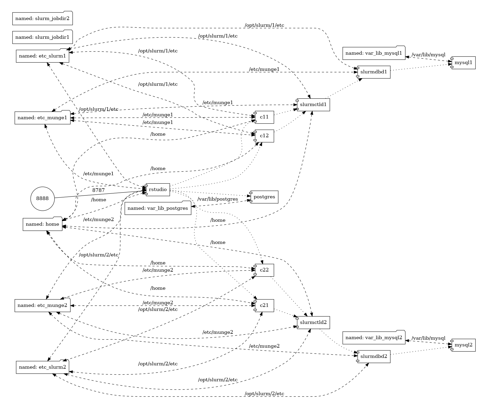
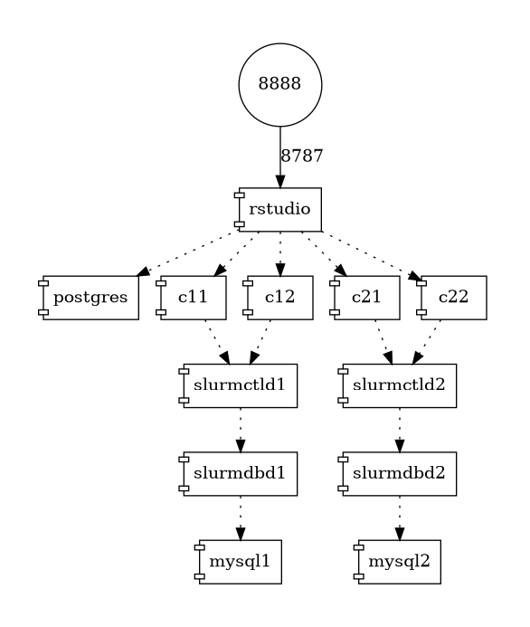

# Slurm Docker Cluster

This is a multi-container Slurm cluster using docker-compose.  The compose file
creates named volumes for persistent storage of MySQL and Postgres data files as well as
Slurm state and log directories.

This is the information for running Posit Workbench against two clusters with different SLURM versions.

## Containers and Volumes

The compose file will run the following containers:

* postgres
* mysql1
* slurmdbd1
* slurmctld1
* c11 (slurmd)
* c12 (slurmd)
* mysql2
* slurmdbd2
* slurmctld2
* c12 (slurmd)
* c12 (slurmd)
* rstudio

The compose file will create the following named volumes:

* var_libpostgres     	 ( -> /var/lib/postgres )
* etc_munge1         	 ( -> /etc/munge        )
* etc_slurm1         	 ( -> /opt/slurm/1/etc  )
* slurm_jobdir1     	 ( -> /data             )
* var_lib_mysql1     	 ( -> /var/lib/mysql    )
* var_libpostgres     	 ( -> /var/lib/postgres )
* etc_munge2         	 ( -> /etc/munge        )
* etc_slurm2         	 ( -> /opt/slurm/2/etc  )
* slurm_jobdir2     	 ( -> /data             )
* var_lib_mysql2     	 ( -> /var/lib/mysql    )
* home	 		         ( -> /home             )

## General Architecture

The dependency is shown in the image below. As you can see, there is two distinct and independent clusters that all depend on the rstudio container where Posit Workbench runs. 



A more detailed view contains the mounted volumes as well. 




## Building the Docker Image

The setup uses one single docker image named `slurm-docker-cluster`. You can build this directly via  `docker-compose`

```console
docker-compose build 
```
which will build the `slurm-docker-cluster` using default values for the versions of RStudio Workbench and SLURM and for Ubuntu 24.04 LTS (Jammy).

The current default versions are 
* Posit Workbench (`PWB_VERSION`): 2025.09.1-401.pro2
* SLURM Version Cluster 1 (`SLURM_VERSION1`): 24.11.6-1
* SLURM Version Cluster 2 (`SLURM_VERSION2`): 23.11.11-1

If you wanted to use a different Posit Workbench and SLURM version (or a different Ubuntu LTS version), you can set the environment variables `PWB_VERSION`, `SLURM_VERSION1`, `SLURM_VERSION2` `DIST` and `DISTNUM`to your desired Workbench and SLURM version. e.g. 

```console
export PWB_VERSION="2023.09.0-daily-203.pro2"
export SLURM_VERSION="23.02.3-1" 
export DIST="jammy"
export DISTNUM="2204"
```                                                  


## Starting the Cluster

Run `docker-compose` to instantiate the cluster:

```console
docker-compose up -d
```

Note: Make sure you have the environment variable `RSP_LICENSE` set to a valid license key for Posit Workbench.  

## RStudio Workbench availability

Once the cluster is up and running, RSWB is available at http://localhost:8988 

## Accessing the Cluster

Use `docker-compose exec` to run a bash shell on the controller container of cluster 1:

```console
docker compose exec slurmctld1 bash
```

From the shell, execute slurm commands, for example:

```console
[root@slurmctld1 /]# sinfo
PARTITION AVAIL  TIMELIMIT  NODES  STATE NODELIST
normal*      up 5-00:00:00      2   idle c[1-2]
```

## Submitting Jobs

The `slurm_jobdir` named volume is mounted on each Slurm container as `/data`.
Therefore, in order to see job output files while on the controller, change to
the `/data` directory when on the **slurmctld** container and then submit a job:

```console
[root@slurmctld /]# cd /data/
[root@slurmctld data]# sbatch --wrap="uptime"
Submitted batch job 2
[root@slurmctld data]# ls
slurm-2.out
```

## Stopping and Restarting the Cluster

```console
docker-compose stop
docker-compose start
```

or for restarting simply

```console
docker-compose restart
```

## Deleting the Cluster

To remove all containers and volumes, run:

```console
docker-compose down
docker volume ls  | grep slurm-docker-cluster | \
	awk '{print $2}' | xargs docker volume rm 
```


# Notes on a possible implementation outside of docker

## home-directories and user management 

It is assumed that home-directoreis and user management (authentication) are handled the same way on both HPC clusters. 

## munged
`munged` must be configured to use different sockets and different log files... This is best done in `/etc/default/munge` and could look like the one below

```bash
CLUSTER="1"
OPTIONS="--key-file=/etc/munge/munge.key.${CLUSTER} \
    --log-file=/var/log/munge/munged${CLUSTER} .log \
    --pid-file=/run/munge/munged.pid.${CLUSTER}  \
    --socket=/run/munge/munge.socket.${CLUSTER}"
```

Since munged, in particular the socket, is referenced by `slurm.conf`, the configuration must be consistent within the respective cluster as well as on the Workbench server. The above is just a suggestion that should help everyone come up with their own implementation details. 

Eventually in `slurm.conf` you then can reference the non-default munge socket 

```bash
AuthInfo=socket=/run/munge/munge.socket.1
```

In order for this to work properly, you will need to patch SLURM with the below [patch](slurm/munge.patch):

```bash
--- a/src/interfaces/auth.c
+++ b/src/interfaces/auth.c
@@ -335,14 +335,18 @@ void *auth_g_create(int index, char *auth_info, uid_t r_uid,
                    void *data, int dlen)
 {
        cred_wrapper_t *cred;
+       char *info = auth_info;
 
        xassert(g_context_num > 0);
 
        if (r_uid == SLURM_AUTH_NOBODY)
                return NULL;
 
+       if (!info)
+        info = slurm_conf.authinfo;
+
        slurm_rwlock_rdlock(&context_lock);
-       cred = (*(ops[index].create))(auth_info, r_uid, data, dlen);
+       cred = (*(ops[index].create))(info, r_uid, data, dlen);
        slurm_rwlock_unlock(&context_lock);
 
        if (cred)
```

## SLURM setup

Besides the consistent `munged` setup, there is a need to install two SLURM versions on the Posit Workbench Server, each representing the version of SLURM that is in use of the respective cluster. 

`slurm.conf` for each install must be findable. If both SLURM installations already use a different base installation directory, there is no problem. If however on the respective SLURM clusters the base installation directory is the same, additional care has to be taken on the Posit Workbench server. One of the SLURM versions need to be rebuilt/installed into a different folder. `slurm.conf` then can be made findable by defining `SLURM_CONF` in `/etc/rstudio/launcher-env`, e.g. 

```bash
Cluster: cluster1
Environment: SLURM_CONF=/path/to/cluster1/slurm.conf

Cluster: cluster2
Environment: SLURM_CONF=/path/to/cluster2/slurm.conf
```

## Posit Workbench Integration

As a prerequisite it is assumes that on the Workbench server
* the respective SLURM versions of each cluster are available
* `slurm.conf` from each cluster is accessible
* `munged` process for each cluster has been configured to avoid any collusion in terms of sockets (see above)

If that is in place, we can add to `/etc/rstudio/launcher.conf` two new SLURM launcher definitions, e.g. 

```bash
[cluster]
name=cluster1
type=Slurm
config-file=/etc/rstudio/launcher.cluster1.conf 

[cluster]
name=cluster2
type=Slurm
config-file=/etc/rstudio/launcher.cluster2.conf 
```

following which we can for exanple create `/etc/rstudio/launcher.cluster1.conf` as

```bash
# Basic configuration
slurm-service-user=slurm
slurm-bin-path=/path/to/cluster/1/slurm/bin

# User/group and resource profiles
profile-config=/etc/rstudio/launcher.cluster1.profiles.conf
resource-profile-config=/etc/rstudio/launcher.cluster1.resources.conf
```

The resource and user/group profiles can then be configured to everyone's liking.

## Things not covered in this doc

* How to submit jobs from the Workbench server to either cluster using the SLURM CLI
* How to deal with different user home-directories
* ... 